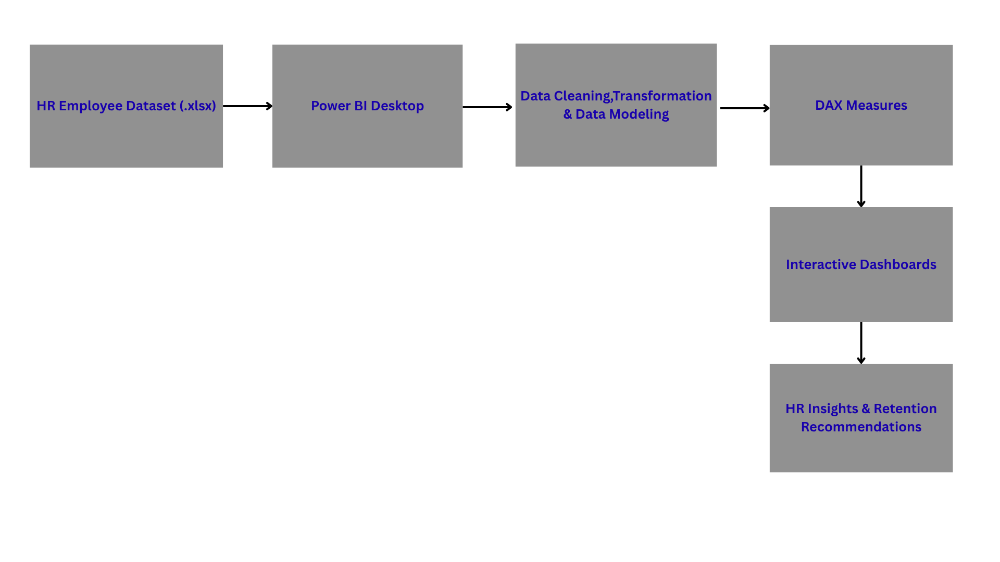

# HR-Attrition-Insights-2025
Interactive HR Analytics Dashboard built using Power BI Desktop and DAX.

## Project Overview

This project is an end-to-end HR analytics solution built in Power BI Desktop to analyze employee attrition, identify key workforce trends, and provide actionable insights for HR decision-making.

The dashboard combines interactive visualizations, KPI cards, DAX calculations, forecasting, and storytelling techniques to help organizations understand employee turnover and improve retention strategies.

## Business Problem

High employee attrition increases recruitment costs, reduces productivity, and affects organizational performance.

This project analyzes HR data to identify:

Departments with the highest attrition
Employee groups at higher risk of leaving
Retention trends over time
Key workforce insights for HR leadership

The goal is to support data-driven HR decisions using interactive Power BI dashboards.

## Solution Architecture

